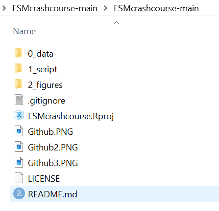
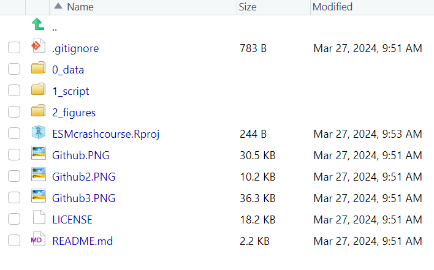

# VNOP-CAS days 2023: ESM crashcourse

These are workshop materials for the data analysis crash course for the VNOP-CAS days in 2023.

In the folder `0_data`, you can find the raw dataset and a cleaned version of this dataset.
For the analyses, you need the raw dataset, but we will save the cleaned dataset together in this tutorial.

In the folder `1_script`, you can find multiple R files.
For now, we will work with the file [`1_interactive_analyses_ESM_crashcourse.R`](https://github.com/DominiqueMaciejewski/VNOPworkshop2023/blob/main/1_script/1_interactive_analyses_ESM_crashcourse.R) .
Using this file, we will discuss some basic coding practices and some exercises.

The solution of the exercises, you can find under [`2_solutions_interactive_analyses_ESM_crashcourse.R`](https://github.com/DominiqueMaciejewski/VNOPworkshop2023/blob/main/1_script/2_solutions_interactive_analyses_ESM_crashcourse.R)

There is an additional file with much more explanation and extra analyses!
This file is rendered in Rmarkdown.
If you open the file [`3_complete_analyses_ESM_crashcourse.html`](https://github.com/DominiqueMaciejewski/VNOPworkshop2023/blob/main/1_script/3_complete_analyses_ESM_crashcourse.html) in your browser (just open it once you downloaded the workshop materials), then you will see a pretty, knitted version with all extra information you need.
Note: it will not look pretty if you just look at it on Github!

If you only want to see the R code, you can also open [`3_complete_analyses_ESM_crashcourse.Rmd`](https://github.com/DominiqueMaciejewski/VNOPworkshop2023/blob/main/1_script/3_complete_analyses_ESM_crashcourse.Rmd) .

In the folder `2_figures`, you can find some plots that we will make together during the workshop.

For now, download the code.
Unpack the folder and double click on `VNOPworkshop2023.Rproj`

{width="396"}

Then, your `R` will open.
Click on the `Files` pane on `1_script` -\> `1_interactive_analyses_ESM_crashcourse.R`

{width="403"}

For any questions, please feel free to contact me via [d.f.maciejewski\@tilburguniversity.edu](mailto:d.f.maciejewski@tilburguniversity.edu){.email}

*Copyright (c) Dominique Maciejewski, License: CC BY 4.0 \| Attribution 4.0 International*
